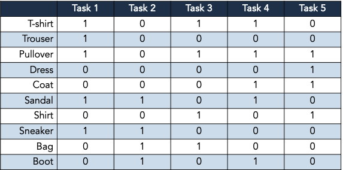

# A Practical Guide to Streaming Continual Learning - Motivating Example

This repository contains the official code for the motivating example presented in the paper **"A Practical Guide to Streaming Continual Learning"** published in *Neurocomputing* (2026).

The code reproduces the experiments discussed in Section 6 of the paper. It compares Streaming Machine Learning (SML) and Online Continual Learning (OCL) solutions in two different scenarios:
- **Virtual drifts scenario** involves only virtual drifts, each introducing a new feature subspace that extends the decision boundary. The previously observed concepts are assumed to remain valid.
- **Real drift scenario** all the concepts share the same input distribution. Each drift introduces a new classification problem which may invalidate the previous.

Both scenarios refer to the Domain Incremental Learning setting with five experiences, each including the same two binary labels 0 and 1. 

# Requirements
`requirements.txt` contains the package to be installed with Python 3.10.12

# **Datasets**  
The `datasets` folder contains csv files whose names follow the following structure: `<dataset>_<umap_dim>red_<scenario>_<conf_id>conf_<train/test>.csv`.

- **dataset**: two dataset are considered: mnist and fashion_mnist. 
- **umap_dim**: a UMAP dimensionality reduction is applied to both datasets (30 features for mnist, 50 for mnist)
- **scenario**: it could be "real" or "virtual". In the real drift scenario each experience contains all the types digits (mnist) or all the types of clothes (fashion mnist). In the virtual drift scenario each experience introduces a new pair of digits or clothes.
    - mnist virtual drift classification problem: even vs. odd
    - mnist real drift classification problems: even vs. odd, greater than four vs. less than or equal to four, multiple of three vs. not multiple of three, prime number including one vs. non-prime excluding one, and inside the range $[2,5]$ vs. outside the range $[2,5]$.
    - fashion mnist virtual drift classification problem: task 1
    - fashion mnist virtual drift classification problem: all the five tasks:
  
- **conf_id**: for each dataset 10 configurations are generated, each of which has a particular tasks order
- **train_test**: train is used for the prequential evaluation and represent the stream. test is used for the CL evaluation. See the details of the two evaluations in the "Evaluation metrics" section. "task" column represents the task label, while "target" is the ground truth. The remaining columns are the features obtained after applying UMAP.

# **Models and execution**  

#### **SML Models**  

The following SML are evaluated using **River**:  
- **Hoeffding Adaptive Tree (HAT)**: A streaming version of Decision Trees that implements an internal drift detector to adapt to new concepts.
- **Adaptive Random Forest (ARF)**: A standard ensemble method for data streams using HAT.  

The execution script **`run_sml.py`** contains the implementation. Results are stored in the performance directory in the pickle file `performance_sml.pkl` and `cl_table_sml.pkl`.

#### **OCL Models**  

For OCL, we use an **SimpleMLP** as the base learner. The following CL strategies are tested, all implemented using **Avalanche**:  

- **Naïve**: Plain SimpleMLP without any specific CL strategy.  
- **Experience Replay (ER)**: Stores and replays past data to mitigate forgetting.  
- **ER + Learning without Forgetting (ER + LwF)**: Combines ER with knowledge distillation to retain past knowledge.  
- **Elastic Weight Consolidation (EWC)**: Regularizes updates to prevent drastic changes in important parameters.  
- **Learning without Forgetting (LwF)**: Uses knowledge distillation to transfer knowledge from old to new tasks.  
- **Average Gradient Episodic Memory (AGEM)**: Controls updates using memory gradients to reduce forgetting.  
- **Maximal Interfered Retrieval (MIR)**: Prioritizes replay samples that would be most affected by updates.  
- **Progressive Neural Networks (PNN)**: Architectural strategy that composes layers of SimpleMLP, one for each task. It requires knowing the task label during inference.

The execution script **`run_cl.py`** contains the implementation. The strategies are aware about the task boundaries and trained on mini-batches with size 10 for one epoch. Results are stored in the performance directory in the pickle files `performance_cl.pkl` and `cl_table_cl.pkl`.

# Evaluation Metrics  

Given the possible class imbalance, we use **Cohen’s Kappa** and **Balanced Accuracy** to provide a fair assessment of classification performance.

#### Prequential Evaluation  
The evaluation follows a **test-then-train** approach, where each incoming data point is first tested and then used for training on the training data stream.

It is stored in `performance_<cl/sml>.pkl` files, containing for each timestamp:
- Concept performance: Performance is reset after each drift to analyze how models perform on entire concepts.  
- Rolling window with window size of 500 and 1000: it emphasizes recent data points.  
- Reset rolling window with window size of 500 and 1000: The rolling window is reset after each drift, ensuring a fresh evaluation per concept.  

#### Continual Learning Metrics  
To assess forgetting, for each model's checkpoint, we compute the metrics on all the test sets and store the results in the `cl_table_<cl/sml>.pkl` files.

"Naive_freezed", "ARF_freezed", and "HAT_freezed" represent strategies that, when tested on task i, select the checkpoint of the model trained after task i. 

## Citation
If you use this code or find our work helpful in your research, please cite our paper:

**Plain Text:**
> Andrea Cossu, Federico Giannini, Giacomo Ziffer, Alessio Bernardo, Alexander Gepperth, Emanuele Della Valle, Barbara Hammer, Davide Bacciu: A practical guide to streaming continual learning. Neurocomputing 674: 132951 (2026)

**BibTeX:**
```bibtex
@article{cossu_scl_2026,
  author       = {Andrea Cossu and
                  Federico Giannini and
                  Giacomo Ziffer and
                  Alessio Bernardo and
                  Alexander Gepperth and
                  Emanuele Della Valle and
                  Barbara Hammer and
                  Davide Bacciu},
  title        = {A practical guide to streaming continual learning},
  journal      = {Neurocomputing},
  volume       = {674},
  pages        = {132951},
  year         = {2026}
}
